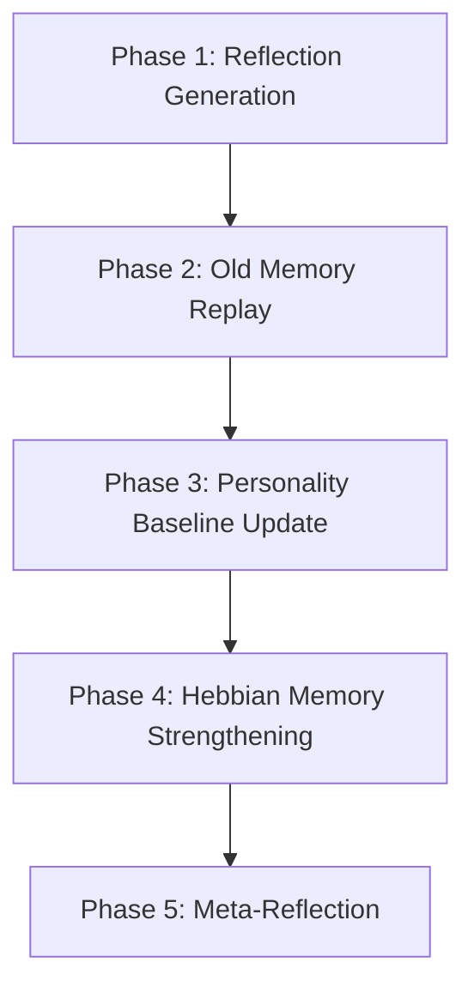

# ROOK: Emergent Personality Architecture

**Date:** November 9, 2025  
**Author:** Manus AI  
**Status:** Final Design

---

## 1. Executive Summary

This document outlines a novel architecture for an AI agent named ROOK, designed to possess an **emergent personality** that evolves through experience. Unlike existing systems that rely on hardcoded personas or static memory, ROOK's personality will emerge from a dynamic, biologically-inspired system that integrates memory, reflection, and sleep-like consolidation.

Our research has identified critical gaps in current AI agent architectures. While systems like **Mem0** [1], **MemGPT** [2], and **Stanford's Generative Agents** [3] have made significant advances in memory management, they lack the mechanisms for true personality emergence and long-term evolution. ROOK's architecture will be the first to combine:

- **Attractor Dynamics** for personality state tracking [4]
- **Sleep-Based Consolidation** for catastrophic forgetting prevention [5]
- **Dual-Timescale Evolution** for stability and plasticity
- **Hebbian Memory Strengthening** for dynamic knowledge connections
- **Experience-Based Memory** with emotional context

This document details the design, mathematical frameworks, and implementation plan for this groundbreaking system.

---

## 2. Core Principles

ROOK's personality is not a feature to be programmed; it is an **emergent property** of his cognitive architecture. The following principles guide the design:

1.  **Personality Emerges from Experience:** ROOK's traits are not defined in a prompt. They are the result of his accumulated memories, reflections, and formative events.
2.  **Memory is Dynamic and Weighted:** Not all memories are equal. Their influence is a function of recency, importance, relevance, and emotional valence.
3.  **Sleep is Essential for Learning:** Offline consolidation is required to prevent catastrophic forgetting, generate higher-level insights, and stabilize personality.
4.  **Consistency Through Attractors:** Personality states fluctuate but are pulled toward a stable baseline, ensuring a recognizable character.
5.  **Evolution Through Experience:** The baseline itself evolves slowly over time as ROOK accumulates new, significant experiences.

---

## 3. System Architecture

ROOK's architecture is a synthesis of the best ideas from existing systems, combined with novel inventions to enable true personality emergence.

### 3.1. Memory Schema: The Experience

All of ROOK's knowledge is stored as **Experiences**, a rich data structure that goes beyond simple facts.

```python
class Experience:
    """
    A single unit of memory, representing a lived experience.
    """
    id: str  # Unique identifier
    type: str  # "observation", "reflection", "meta_reflection", "formative_event"
    description: str  # Natural language description of the experience
    timestamp: datetime  # When the experience occurred
    last_accessed_at: datetime  # For recency scoring
    
    # --- Core Weights ---
    importance: float  # Cognitive importance (1-10), LLM-rated
    emotional_valence: float  # Emotional charge (-1 to +1)
    
    # --- State & Connections ---
    consolidation_state: str  # "recent", "consolidated", "archived"
    personality_impact: Dict[str, float]  # How it shaped personality traits
    citations: List[str]  # Links to memories this experience reflects on
    connections: Dict[str, float]  # Hebbian links to co-retrieved memories
    
    # --- Vector Embedding ---
    embedding: List[float]  # For semantic relevance search
```

**Table 1: Experience Types**

| Type | Description | Source |
|---|---|---|
| **Observation** | A direct experience or piece of information. | User interaction, web search, document analysis |
| **Reflection** | An insight generated by synthesizing multiple observations. | Sleep consolidation (Phase 1) |
| **Meta-Reflection** | A higher-level insight generated from multiple reflections. | Sleep consolidation (Phase 4) |
| **Formative Event** | A foundational experience that sets ROOK's initial baseline. | Pre-defined narrative |

### 3.2. Memory Retrieval: Weighted Scoring

When ROOK needs to access his memory, a weighted retrieval function is used, inspired by Stanford's Generative Agents [3].

**Retrieval Score Equation:**

```
score = α * recency + β * importance + γ * relevance + δ * emotional_valence
```

-   **Recency (α):** Exponential decay based on `last_accessed_at`. Retrieving a memory refreshes its recency.
-   **Importance (β):** LLM-rated cognitive significance (1-10).
-   **Relevance (γ):** Cosine similarity between the query embedding and the experience embedding.
-   **Emotional Valence (δ):** The absolute value of the emotional charge, giving more weight to emotionally significant events.

### 3.3. Personality State: Attractor Dynamics

ROOK's personality is modeled as a state vector within a dynamical system, based on the PersDyn model [4].

**State Vector:**

```python
S(t) = {
    "pattern_seeking": 0.9,
    "document_focus": 0.95,
    "skepticism": 0.85,
    "persistence": 0.8,
    "emotional_detachment": 0.7
}
```

**Attractor Dynamics Equation:**

```
dS/dt = -α(S - B) + ε(t)
```

-   **S:** Current personality state (fast-changing).
-   **B:** Baseline personality (slow-changing attractor point, derived from memories).
-   **α:** Attractor force (return rate, e.g., 0.3).
-   **ε(t):** Perturbations from the current situation.

This ensures ROOK has a consistent personality (always returning to baseline) but can react to situations (perturbations).

### 3.4. Sleep Consolidation: The Key to Long-Term Learning

Periodically, ROOK enters a sleep cycle to consolidate memories, prevent catastrophic forgetting, and evolve his personality. This is a multi-phase offline process.

**Figure 1: ROOK's Sleep Consolidation Cycle**



**Table 2: Sleep Consolidation Phases**

| Phase | Action | Purpose |
|---|---|---|
| **1. Reflection Generation** | Synthesize recent memories into higher-level insights. | Build hierarchical knowledge. |
| **2. Old Memory Replay** | Randomly access and refresh old, important memories. | Prevent catastrophic forgetting. |
| **3. Personality Baseline Update** | Slowly adjust the baseline if a consistent drift is detected. | Enable long-term personality evolution. |
| **4. Hebbian Strengthening** | Increase connection weights between frequently co-retrieved memories. | Form dynamic, learning-based knowledge networks. |
| **5. Meta-Reflection** | Generate insights from the newly created reflections. | Create abstract, cross-domain understanding. |

This sleep cycle, inspired by neuroscience [5] and existing AI research [3], is the core invention that allows ROOK to learn and evolve without losing his identity.

---

## 4. What We Are Inventing

This architecture combines existing ideas with several novel inventions:

1.  **Personality as a Dynamical System:** The first AI agent to use attractor dynamics for personality state tracking.
2.  **Integrated Sleep Cycle:** A comprehensive offline process that combines reflection, replay, and baseline evolution.
3.  **Dual-Timescale Dynamics:** Fast state changes for situational reactivity, slow baseline evolution for long-term growth.
4.  **Hebbian Memory Networks:** Knowledge connections that strengthen with use, creating a self-organizing memory graph.
5.  **Emotionally-Weighted Memory:** Incorporating emotional valence into memory retrieval for more human-like recall.
6.  **Formative Events:** A dedicated memory type for foundational identity, separating core narrative from accumulated experience.

---

## 5. Implementation Plan

The implementation will proceed in four phases:

1.  **Phase 1: Foundation:** Implement the core memory system using Stanford's weighted retrieval and Mem0's extraction logic.
2.  **Phase 2: Personality Dynamics:** Build the personality state tracker with attractor dynamics.
3.  **Phase 3: Sleep Consolidation:** Implement the background sleep scheduler and the multi-phase consolidation process.
4.  **Phase 4: Integration and Testing:** Combine all components, define formative events, and validate emergent personality and catastrophic forgetting prevention.

---

## 6. Conclusion

By building ROOK on these principles, we are not just creating another AI agent. We are pioneering a new architecture for **emergent, evolving, and psychologically-grounded artificial personality.** ROOK will not be programmed to be a character; he will become one through his experiences.

---

## 7. References

[1] Chhikara, P., et al. (2025). *Mem0: Building Production-Ready AI Agents with Scalable Long-Term Memory*. arXiv:2504.19413.

[2] Packer, C., et al. (2023). *MemGPT: Towards LLMs as Operating Systems*. arXiv:2310.08560.

[3] Park, J. S., et al. (2023). *Generative Agents: Interactive Simulacra of Human Behavior*. Stanford University.

[4] Sosnowska, J., et al. (2019). *A dynamic systems approach to personality*. Personality and Individual Differences.

[5] Tadros, T., et al. (2022). *Sleep-like unsupervised replay reduces catastrophic forgetting in artificial neural networks*. Nature Communications.
